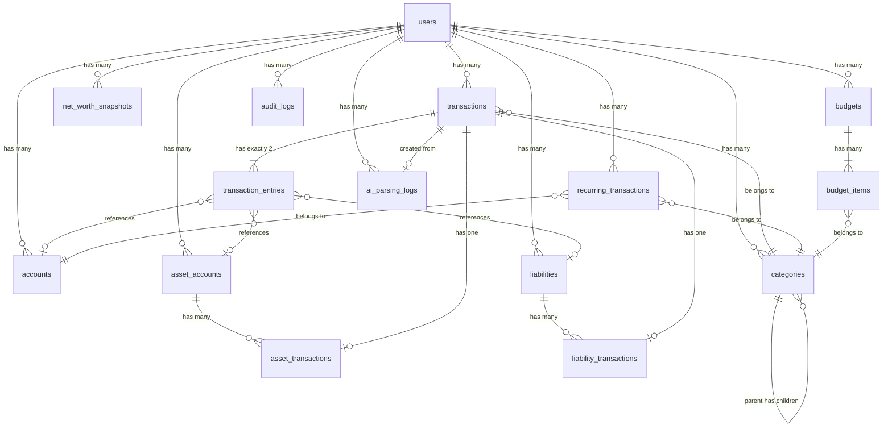

# 05 — Database Schema

> **Document Version**: 1.0  
> **Last Updated**: 2026-08-25  
> **Status**: Approved for Implementation  
> **Cross-references**: [03_FEATURE_SPECIFICATION](./03_FEATURE_SPECIFICATION.md), [04_SYSTEM_ARCHITECTURE](./04_SYSTEM_ARCHITECTURE.md)

---

## 1. Design Principles

1. **Integer money**: All IDR monetary amounts stored as `BIGINT` (1 = 1 Rupiah)
2. **Decimal precision**: Asset quantities and prices use `DECIMAL` with appropriate precision
3. **Simplified double-entry**: Every transaction has exactly 2 entries (debit + credit)
4. **Soft deletes**: Applied to entities that are referenced by transactions (accounts, categories)
5. **UUID primary keys**: Use UUIDs for all primary keys (better for future API exposure, no sequential guessing)
6. **Timestamps**: `created_at` and `updated_at` on all tables (UTC)
7. **User scoping**: All data tables have `user_id` FK for future multi-user support
8. **Currency field**: Present on all monetary entities for future multi-currency

---

## 2. Entity Relationship Diagram



---

## 3. Table Definitions

### 3.1 users

```sql
CREATE TABLE users (
    id              UUID PRIMARY KEY DEFAULT gen_random_uuid(),
    name            VARCHAR(100) NOT NULL,
    email           VARCHAR(255) NOT NULL UNIQUE,
    email_verified_at TIMESTAMP WITH TIME ZONE,
    password        VARCHAR(255) NOT NULL,
    
    -- Settings
    timezone        VARCHAR(50) NOT NULL DEFAULT 'Asia/Jakarta',
    theme           VARCHAR(10) NOT NULL DEFAULT 'system',  -- 'dark', 'light', 'system'
    default_currency VARCHAR(3) NOT NULL DEFAULT 'IDR',
    date_format     VARCHAR(20) NOT NULL DEFAULT 'DD/MM/YYYY',
    month_start_day SMALLINT NOT NULL DEFAULT 1,  -- 1-28
    default_account_id UUID,  -- FK to accounts (nullable, set after first account)
    
    -- WhatsApp (V1.5)
    whatsapp_number VARCHAR(20),
    whatsapp_verified BOOLEAN NOT NULL DEFAULT FALSE,
    
    remember_token  VARCHAR(100),
    created_at      TIMESTAMP WITH TIME ZONE NOT NULL DEFAULT NOW(),
    updated_at      TIMESTAMP WITH TIME ZONE NOT NULL DEFAULT NOW()
);

CREATE INDEX idx_users_email ON users(email);
```

### 3.2 accounts

Cash, bank, and e-wallet accounts.

```sql
CREATE TABLE accounts (
    id              UUID PRIMARY KEY DEFAULT gen_random_uuid(),
    user_id         UUID NOT NULL REFERENCES users(id) ON DELETE CASCADE,
    
    name            VARCHAR(100) NOT NULL,
    type            VARCHAR(20) NOT NULL,  -- 'cash', 'bank', 'ewallet'
    currency        VARCHAR(3) NOT NULL DEFAULT 'IDR',
    initial_balance BIGINT NOT NULL DEFAULT 0,
    current_balance BIGINT NOT NULL DEFAULT 0,  -- Denormalized, kept in sync
    
    icon            VARCHAR(50),
    color           VARCHAR(7),  -- Hex color e.g. '#3B82F6'
    description     VARCHAR(255),
    
    is_active       BOOLEAN NOT NULL DEFAULT TRUE,
    sort_order      SMALLINT NOT NULL DEFAULT 0,
    
    created_at      TIMESTAMP WITH TIME ZONE NOT NULL DEFAULT NOW(),
    updated_at      TIMESTAMP WITH TIME ZONE NOT NULL DEFAULT NOW(),
    deleted_at      TIMESTAMP WITH TIME ZONE,  -- Soft delete
    
    CONSTRAINT uq_accounts_user_name UNIQUE (user_id, name),
    CONSTRAINT chk_accounts_type CHECK (type IN ('cash', 'bank', 'ewallet'))
);

CREATE INDEX idx_accounts_user_id ON accounts(user_id);
CREATE INDEX idx_accounts_user_active ON accounts(user_id, is_active) WHERE deleted_at IS NULL;
```

### 3.3 categories

```sql
CREATE TABLE categories (
    id              UUID PRIMARY KEY DEFAULT gen_random_uuid(),
    user_id         UUID NOT NULL REFERENCES users(id) ON DELETE CASCADE,
    parent_id       UUID REFERENCES categories(id) ON DELETE SET NULL,
    
    name            VARCHAR(100) NOT NULL,
    type            VARCHAR(10) NOT NULL,  -- 'income', 'expense'
    icon            VARCHAR(50) NOT NULL DEFAULT 'circle',
    color           VARCHAR(7) NOT NULL DEFAULT '#6B7280',
    
    is_system       BOOLEAN NOT NULL DEFAULT FALSE,  -- System defaults can't be deleted
    is_active       BOOLEAN NOT NULL DEFAULT TRUE,
    sort_order      SMALLINT NOT NULL DEFAULT 0,
    
    created_at      TIMESTAMP WITH TIME ZONE NOT NULL DEFAULT NOW(),
    updated_at      TIMESTAMP WITH TIME ZONE NOT NULL DEFAULT NOW(),
    deleted_at      TIMESTAMP WITH TIME ZONE,
    
    CONSTRAINT uq_categories_user_name_type UNIQUE (user_id, name, type, parent_id),
    CONSTRAINT chk_categories_type CHECK (type IN ('income', 'expense'))
);

CREATE INDEX idx_categories_user_id ON categories(user_id);
CREATE INDEX idx_categories_parent_id ON categories(parent_id);
CREATE INDEX idx_categories_user_type ON categories(user_id, type) WHERE deleted_at IS NULL;
```

### 3.4 transactions

The transaction header. Each transaction has exactly 2 `transaction_entries`.

```sql
CREATE TABLE transactions (
    id              UUID PRIMARY KEY DEFAULT gen_random_uuid(),
    user_id         UUID NOT NULL REFERENCES users(id) ON DELETE CASCADE,
    category_id     UUID REFERENCES categories(id) ON DELETE SET NULL,
    
    type            VARCHAR(30) NOT NULL,
    -- 'income', 'expense', 'transfer', 'asset_purchase', 'asset_sale',
    -- 'liability_payment', 'liability_increase', 'adjustment'
    
    date            DATE NOT NULL,
    amount          BIGINT NOT NULL,  -- Gross amount in smallest currency unit
    currency        VARCHAR(3) NOT NULL DEFAULT 'IDR',
    
    description     VARCHAR(255) NOT NULL,
    notes           TEXT,
    reference_number VARCHAR(100),
    
    source          VARCHAR(20) NOT NULL DEFAULT 'manual',
    -- 'manual', 'ai_web', 'whatsapp', 'recurring', 'import'
    
    is_confirmed    BOOLEAN NOT NULL DEFAULT TRUE,
    
    created_at      TIMESTAMP WITH TIME ZONE NOT NULL DEFAULT NOW(),
    updated_at      TIMESTAMP WITH TIME ZONE NOT NULL DEFAULT NOW(),
    deleted_at      TIMESTAMP WITH TIME ZONE,
    
    CONSTRAINT chk_transactions_amount_positive CHECK (amount > 0),
    CONSTRAINT chk_transactions_type CHECK (type IN (
        'income', 'expense', 'transfer', 'asset_purchase', 'asset_sale',
        'liability_payment', 'liability_increase', 'adjustment'
    )),
    CONSTRAINT chk_transactions_source CHECK (source IN (
        'manual', 'ai_web', 'whatsapp', 'recurring', 'import'
    ))
);

CREATE INDEX idx_transactions_user_id ON transactions(user_id);
CREATE INDEX idx_transactions_user_date ON transactions(user_id, date DESC) WHERE deleted_at IS NULL;
CREATE INDEX idx_transactions_user_type ON transactions(user_id, type) WHERE deleted_at IS NULL;
CREATE INDEX idx_transactions_user_category ON transactions(user_id, category_id) WHERE deleted_at IS NULL;
CREATE INDEX idx_transactions_description ON transactions USING gin(to_tsvector('simple', description))
    WHERE deleted_at IS NULL;
```

### 3.5 transaction_entries

The double-entry lines. Exactly 2 per transaction.

```sql
CREATE TABLE transaction_entries (
    id              UUID PRIMARY KEY DEFAULT gen_random_uuid(),
    transaction_id  UUID NOT NULL REFERENCES transactions(id) ON DELETE CASCADE,
    
    -- Polymorphic account reference
    -- Exactly one of these should be non-null (or all null for virtual entries)
    account_id      UUID REFERENCES accounts(id) ON DELETE SET NULL,
    asset_account_id UUID REFERENCES asset_accounts(id) ON DELETE SET NULL,
    liability_id    UUID REFERENCES liabilities(id) ON DELETE SET NULL,
    
    entry_type      VARCHAR(6) NOT NULL,  -- 'debit' or 'credit'
    amount          BIGINT NOT NULL,  -- Always positive
    
    created_at      TIMESTAMP WITH TIME ZONE NOT NULL DEFAULT NOW(),
    
    CONSTRAINT chk_entries_amount_positive CHECK (amount > 0),
    CONSTRAINT chk_entries_type CHECK (entry_type IN ('debit', 'credit'))
);

CREATE INDEX idx_entries_transaction_id ON transaction_entries(transaction_id);
CREATE INDEX idx_entries_account_id ON transaction_entries(account_id) WHERE account_id IS NOT NULL;
CREATE INDEX idx_entries_asset_account_id ON transaction_entries(asset_account_id) WHERE asset_account_id IS NOT NULL;
CREATE INDEX idx_entries_liability_id ON transaction_entries(liability_id) WHERE liability_id IS NOT NULL;
```

### 3.6 asset_accounts

Tracked investment positions.

```sql
CREATE TABLE asset_accounts (
    id              UUID PRIMARY KEY DEFAULT gen_random_uuid(),
    user_id         UUID NOT NULL REFERENCES users(id) ON DELETE CASCADE,
    
    name            VARCHAR(100) NOT NULL,
    type            VARCHAR(20) NOT NULL,
    -- 'stock', 'mutual_fund', 'crypto', 'other_investment', 'gold',
    -- 'property', 'vehicle', 'other_asset'
    
    platform        VARCHAR(100),  -- 'Stockbit', 'Bibit', 'Indodax', etc.
    ticker          VARCHAR(20),   -- 'BMRI', 'BTC', 'RDPU', etc.
    currency        VARCHAR(3) NOT NULL DEFAULT 'IDR',
    
    -- Quantity-based assets (stocks, mutual funds, crypto, gold)
    quantity        DECIMAL(20,8) NOT NULL DEFAULT 0,
    avg_purchase_price DECIMAL(20,8) NOT NULL DEFAULT 0,
    current_price   DECIMAL(20,8) NOT NULL DEFAULT 0,
    
    -- Value-based assets (property, vehicle, other)
    -- For value-based: current_value = manual_value
    -- For quantity-based: current_value = quantity * current_price
    manual_value    BIGINT,  -- Only for non-quantity assets
    
    last_price_update TIMESTAMP WITH TIME ZONE,
    
    is_active       BOOLEAN NOT NULL DEFAULT TRUE,
    sort_order      SMALLINT NOT NULL DEFAULT 0,
    notes           TEXT,
    
    created_at      TIMESTAMP WITH TIME ZONE NOT NULL DEFAULT NOW(),
    updated_at      TIMESTAMP WITH TIME ZONE NOT NULL DEFAULT NOW(),
    deleted_at      TIMESTAMP WITH TIME ZONE,
    
    CONSTRAINT uq_asset_accounts_user_name UNIQUE (user_id, name),
    CONSTRAINT chk_asset_type CHECK (type IN (
        'stock', 'mutual_fund', 'crypto', 'other_investment',
        'gold', 'property', 'vehicle', 'other_asset'
    ))
);

CREATE INDEX idx_asset_accounts_user_id ON asset_accounts(user_id);
CREATE INDEX idx_asset_accounts_user_type ON asset_accounts(user_id, type) WHERE deleted_at IS NULL;
```

### 3.7 asset_transactions

Records of buying/selling assets.

```sql
CREATE TABLE asset_transactions (
    id              UUID PRIMARY KEY DEFAULT gen_random_uuid(),
    asset_account_id UUID NOT NULL REFERENCES asset_accounts(id) ON DELETE CASCADE,
    transaction_id  UUID NOT NULL REFERENCES transactions(id) ON DELETE CASCADE,
    
    type            VARCHAR(4) NOT NULL,  -- 'buy' or 'sell'
    quantity        DECIMAL(20,8) NOT NULL,
    price_per_unit  DECIMAL(20,8) NOT NULL,
    total_amount    BIGINT NOT NULL,  -- In smallest currency unit
    fees            BIGINT NOT NULL DEFAULT 0,
    
    created_at      TIMESTAMP WITH TIME ZONE NOT NULL DEFAULT NOW(),
    
    CONSTRAINT chk_asset_tx_type CHECK (type IN ('buy', 'sell')),
    CONSTRAINT chk_asset_tx_quantity_positive CHECK (quantity > 0)
);

CREATE INDEX idx_asset_tx_asset_account ON asset_transactions(asset_account_id);
CREATE INDEX idx_asset_tx_transaction ON asset_transactions(transaction_id);
```

### 3.8 liabilities

```sql
CREATE TABLE liabilities (
    id              UUID PRIMARY KEY DEFAULT gen_random_uuid(),
    user_id         UUID NOT NULL REFERENCES users(id) ON DELETE CASCADE,
    
    name            VARCHAR(100) NOT NULL,
    type            VARCHAR(20) NOT NULL,
    -- 'credit_card', 'personal_loan', 'installment', 'other_debt'
    
    currency        VARCHAR(3) NOT NULL DEFAULT 'IDR',
    initial_balance BIGINT NOT NULL DEFAULT 0,
    current_balance BIGINT NOT NULL DEFAULT 0,  -- Denormalized, kept in sync
    
    credit_limit    BIGINT,  -- For credit cards
    interest_rate   DECIMAL(5,2),  -- Annual rate %
    minimum_payment BIGINT,
    due_date_day    SMALLINT,  -- 1-31
    
    start_date      DATE,
    end_date        DATE,
    remaining_terms SMALLINT,  -- For installments
    
    is_active       BOOLEAN NOT NULL DEFAULT TRUE,
    sort_order      SMALLINT NOT NULL DEFAULT 0,
    notes           TEXT,
    
    created_at      TIMESTAMP WITH TIME ZONE NOT NULL DEFAULT NOW(),
    updated_at      TIMESTAMP WITH TIME ZONE NOT NULL DEFAULT NOW(),
    deleted_at      TIMESTAMP WITH TIME ZONE,
    
    CONSTRAINT uq_liabilities_user_name UNIQUE (user_id, name),
    CONSTRAINT chk_liability_type CHECK (type IN (
        'credit_card', 'personal_loan', 'installment', 'other_debt'
    ))
);

CREATE INDEX idx_liabilities_user_id ON liabilities(user_id);
CREATE INDEX idx_liabilities_user_active ON liabilities(user_id, is_active) WHERE deleted_at IS NULL;
```

### 3.9 liability_transactions

Records of liability payments and increases.

```sql
CREATE TABLE liability_transactions (
    id              UUID PRIMARY KEY DEFAULT gen_random_uuid(),
    liability_id    UUID NOT NULL REFERENCES liabilities(id) ON DELETE CASCADE,
    transaction_id  UUID NOT NULL REFERENCES transactions(id) ON DELETE CASCADE,
    
    type            VARCHAR(10) NOT NULL,  -- 'payment' or 'increase'
    amount          BIGINT NOT NULL,
    
    created_at      TIMESTAMP WITH TIME ZONE NOT NULL DEFAULT NOW(),
    
    CONSTRAINT chk_liability_tx_type CHECK (type IN ('payment', 'increase')),
    CONSTRAINT chk_liability_tx_amount_positive CHECK (amount > 0)
);

CREATE INDEX idx_liability_tx_liability ON liability_transactions(liability_id);
CREATE INDEX idx_liability_tx_transaction ON liability_transactions(transaction_id);
```

### 3.10 net_worth_snapshots

Daily snapshots for trend charts.

```sql
CREATE TABLE net_worth_snapshots (
    id              UUID PRIMARY KEY DEFAULT gen_random_uuid(),
    user_id         UUID NOT NULL REFERENCES users(id) ON DELETE CASCADE,
    
    date            DATE NOT NULL,
    total_cash      BIGINT NOT NULL DEFAULT 0,  -- Sum of all account balances
    total_investments BIGINT NOT NULL DEFAULT 0,  -- Sum of all asset values
    total_liabilities BIGINT NOT NULL DEFAULT 0,  -- Sum of all liability balances
    net_worth       BIGINT NOT NULL DEFAULT 0,  -- total_cash + total_investments - total_liabilities
    
    created_at      TIMESTAMP WITH TIME ZONE NOT NULL DEFAULT NOW(),
    
    CONSTRAINT uq_snapshots_user_date UNIQUE (user_id, date)
);

CREATE INDEX idx_snapshots_user_date ON net_worth_snapshots(user_id, date DESC);
```

### 3.11 recurring_transactions (V1.5)

```sql
CREATE TABLE recurring_transactions (
    id              UUID PRIMARY KEY DEFAULT gen_random_uuid(),
    user_id         UUID NOT NULL REFERENCES users(id) ON DELETE CASCADE,
    category_id     UUID NOT NULL REFERENCES categories(id) ON DELETE CASCADE,
    account_id      UUID NOT NULL REFERENCES accounts(id) ON DELETE CASCADE,
    
    name            VARCHAR(100) NOT NULL,
    type            VARCHAR(10) NOT NULL,  -- 'income', 'expense'
    amount          BIGINT NOT NULL,
    currency        VARCHAR(3) NOT NULL DEFAULT 'IDR',
    description     VARCHAR(255) NOT NULL,
    
    frequency       VARCHAR(10) NOT NULL,
    -- 'daily', 'weekly', 'biweekly', 'monthly', 'yearly'
    day_of_month    SMALLINT,  -- 1-28 for monthly
    day_of_week     SMALLINT,  -- 0-6 for weekly (0=Sunday)
    
    start_date      DATE NOT NULL,
    end_date        DATE,  -- Null = indefinite
    
    is_active       BOOLEAN NOT NULL DEFAULT TRUE,
    auto_confirm    BOOLEAN NOT NULL DEFAULT FALSE,
    last_generated_date DATE,
    
    created_at      TIMESTAMP WITH TIME ZONE NOT NULL DEFAULT NOW(),
    updated_at      TIMESTAMP WITH TIME ZONE NOT NULL DEFAULT NOW(),
    
    CONSTRAINT chk_recurring_type CHECK (type IN ('income', 'expense')),
    CONSTRAINT chk_recurring_frequency CHECK (frequency IN (
        'daily', 'weekly', 'biweekly', 'monthly', 'yearly'
    ))
);

CREATE INDEX idx_recurring_user ON recurring_transactions(user_id);
CREATE INDEX idx_recurring_active ON recurring_transactions(is_active, last_generated_date) 
    WHERE is_active = TRUE;
```

### 3.12 budgets (V1.5)

```sql
CREATE TABLE budgets (
    id              UUID PRIMARY KEY DEFAULT gen_random_uuid(),
    user_id         UUID NOT NULL REFERENCES users(id) ON DELETE CASCADE,
    
    name            VARCHAR(100) NOT NULL,
    period_start    DATE NOT NULL,
    period_end      DATE NOT NULL,
    total_budget    BIGINT,  -- Overall limit (optional)
    
    created_at      TIMESTAMP WITH TIME ZONE NOT NULL DEFAULT NOW(),
    updated_at      TIMESTAMP WITH TIME ZONE NOT NULL DEFAULT NOW(),
    
    CONSTRAINT uq_budgets_user_period UNIQUE (user_id, period_start, period_end)
);

CREATE TABLE budget_items (
    id              UUID PRIMARY KEY DEFAULT gen_random_uuid(),
    budget_id       UUID NOT NULL REFERENCES budgets(id) ON DELETE CASCADE,
    category_id     UUID NOT NULL REFERENCES categories(id) ON DELETE CASCADE,
    
    amount          BIGINT NOT NULL,  -- Budget limit
    
    created_at      TIMESTAMP WITH TIME ZONE NOT NULL DEFAULT NOW(),
    updated_at      TIMESTAMP WITH TIME ZONE NOT NULL DEFAULT NOW(),
    
    CONSTRAINT uq_budget_items_budget_category UNIQUE (budget_id, category_id),
    CONSTRAINT chk_budget_items_amount_positive CHECK (amount > 0)
);

CREATE INDEX idx_budget_items_budget ON budget_items(budget_id);
```

### 3.13 ai_parsing_logs (V1.5)

```sql
CREATE TABLE ai_parsing_logs (
    id              UUID PRIMARY KEY DEFAULT gen_random_uuid(),
    user_id         UUID NOT NULL REFERENCES users(id) ON DELETE CASCADE,
    transaction_id  UUID REFERENCES transactions(id) ON DELETE SET NULL,
    
    source          VARCHAR(20) NOT NULL,  -- 'web', 'whatsapp'
    raw_message     TEXT NOT NULL,
    
    parsed_data     JSONB NOT NULL,  -- Structured AI output
    confidence      DECIMAL(3,2) NOT NULL,  -- 0.00 to 1.00
    
    ai_provider     VARCHAR(50) NOT NULL,  -- 'openai', 'gemini'
    ai_model        VARCHAR(100) NOT NULL,  -- 'gpt-4o-mini', 'gemini-2.0-flash'
    prompt_version  VARCHAR(20) NOT NULL,  -- 'v1.0', 'v1.1'
    
    status          VARCHAR(20) NOT NULL DEFAULT 'pending',
    -- 'pending', 'confirmed', 'rejected', 'error'
    
    response_time_ms INTEGER,  -- AI response time in milliseconds
    error_message   TEXT,
    
    created_at      TIMESTAMP WITH TIME ZONE NOT NULL DEFAULT NOW(),
    
    CONSTRAINT chk_ai_confidence CHECK (confidence >= 0 AND confidence <= 1),
    CONSTRAINT chk_ai_status CHECK (status IN ('pending', 'confirmed', 'rejected', 'error'))
);

CREATE INDEX idx_ai_logs_user ON ai_parsing_logs(user_id);
CREATE INDEX idx_ai_logs_status ON ai_parsing_logs(status);
```

### 3.14 webhook_events (V1.5)

```sql
CREATE TABLE webhook_events (
    id              UUID PRIMARY KEY DEFAULT gen_random_uuid(),
    
    provider        VARCHAR(50) NOT NULL,  -- 'whatsapp', 'fonnte', etc.
    event_id        VARCHAR(255) NOT NULL,  -- Provider's message/event ID (idempotency)
    event_type      VARCHAR(50) NOT NULL,  -- 'message', 'status', etc.
    
    payload         JSONB NOT NULL,
    
    status          VARCHAR(20) NOT NULL DEFAULT 'received',
    -- 'received', 'processing', 'processed', 'failed'
    
    processed_at    TIMESTAMP WITH TIME ZONE,
    error_message   TEXT,
    
    created_at      TIMESTAMP WITH TIME ZONE NOT NULL DEFAULT NOW(),
    
    CONSTRAINT uq_webhook_provider_event UNIQUE (provider, event_id),
    CONSTRAINT chk_webhook_status CHECK (status IN ('received', 'processing', 'processed', 'failed'))
);

CREATE INDEX idx_webhook_provider_event ON webhook_events(provider, event_id);
CREATE INDEX idx_webhook_status ON webhook_events(status);
```

### 3.15 audit_logs

```sql
CREATE TABLE audit_logs (
    id              UUID PRIMARY KEY DEFAULT gen_random_uuid(),
    user_id         UUID REFERENCES users(id) ON DELETE SET NULL,
    
    action          VARCHAR(50) NOT NULL,  -- 'create', 'update', 'delete'
    entity_type     VARCHAR(50) NOT NULL,  -- 'transaction', 'account', etc.
    entity_id       UUID NOT NULL,
    
    old_values      JSONB,  -- Previous state
    new_values      JSONB,  -- New state
    
    ip_address      VARCHAR(45),
    user_agent      VARCHAR(500),
    
    created_at      TIMESTAMP WITH TIME ZONE NOT NULL DEFAULT NOW()
);

CREATE INDEX idx_audit_user ON audit_logs(user_id);
CREATE INDEX idx_audit_entity ON audit_logs(entity_type, entity_id);
CREATE INDEX idx_audit_created ON audit_logs(created_at DESC);
```

---

## 4. Key Queries

### 4.1 Calculate Account Balance (Verification)

```sql
-- Verify account balance matches double-entry sum
SELECT 
    a.id,
    a.name,
    a.current_balance AS cached_balance,
    COALESCE(SUM(CASE WHEN te.entry_type = 'credit' THEN te.amount ELSE 0 END), 0) -
    COALESCE(SUM(CASE WHEN te.entry_type = 'debit' THEN te.amount ELSE 0 END), 0)
        AS calculated_balance
FROM accounts a
LEFT JOIN transaction_entries te ON te.account_id = a.id
LEFT JOIN transactions t ON te.transaction_id = t.id AND t.deleted_at IS NULL
WHERE a.user_id = :user_id
GROUP BY a.id, a.name, a.current_balance;
```

### 4.2 Monthly Cash Flow

```sql
SELECT
    COALESCE(SUM(CASE WHEN t.type = 'income' THEN t.amount ELSE 0 END), 0) AS total_income,
    COALESCE(SUM(CASE WHEN t.type = 'expense' THEN t.amount ELSE 0 END), 0) AS total_expense,
    COALESCE(SUM(CASE WHEN t.type = 'income' THEN t.amount ELSE 0 END), 0) -
    COALESCE(SUM(CASE WHEN t.type = 'expense' THEN t.amount ELSE 0 END), 0) AS net_cash_flow
FROM transactions t
WHERE t.user_id = :user_id
  AND t.date >= :month_start
  AND t.date <= :month_end
  AND t.type IN ('income', 'expense')
  AND t.is_confirmed = TRUE
  AND t.deleted_at IS NULL;
```

### 4.3 Net Worth Calculation

```sql
-- Total cash accounts
SELECT COALESCE(SUM(current_balance), 0) AS total_cash
FROM accounts WHERE user_id = :user_id AND is_active = TRUE AND deleted_at IS NULL;

-- Total investments (quantity-based)
SELECT COALESCE(SUM(quantity * current_price), 0) AS total_quantity_assets
FROM asset_accounts 
WHERE user_id = :user_id AND is_active = TRUE AND deleted_at IS NULL
  AND type IN ('stock', 'mutual_fund', 'crypto', 'other_investment', 'gold');

-- Total investments (value-based)
SELECT COALESCE(SUM(manual_value), 0) AS total_value_assets
FROM asset_accounts 
WHERE user_id = :user_id AND is_active = TRUE AND deleted_at IS NULL
  AND type IN ('property', 'vehicle', 'other_asset')
  AND manual_value IS NOT NULL;

-- Total liabilities
SELECT COALESCE(SUM(current_balance), 0) AS total_liabilities
FROM liabilities WHERE user_id = :user_id AND is_active = TRUE AND deleted_at IS NULL;

-- Net worth = total_cash + total_quantity_assets + total_value_assets - total_liabilities
```

### 4.4 Expense by Category (Current Month)

```sql
SELECT 
    c.id,
    c.name,
    c.icon,
    c.color,
    COALESCE(SUM(t.amount), 0) AS total_amount,
    COUNT(t.id) AS transaction_count
FROM categories c
LEFT JOIN transactions t ON t.category_id = c.id
    AND t.type = 'expense'
    AND t.date >= :month_start
    AND t.date <= :month_end
    AND t.is_confirmed = TRUE
    AND t.deleted_at IS NULL
WHERE c.user_id = :user_id
  AND c.type = 'expense'
  AND c.is_active = TRUE
  AND c.deleted_at IS NULL
  AND c.parent_id IS NULL
GROUP BY c.id, c.name, c.icon, c.color
ORDER BY total_amount DESC;
```

---

## 5. Migration Order

Migrations must be created in this order to satisfy FK dependencies:

1. `create_users_table` (modify Laravel default)
2. `create_accounts_table`
3. `create_categories_table`
4. `create_asset_accounts_table`
5. `create_liabilities_table`
6. `create_transactions_table`
7. `create_transaction_entries_table`
8. `create_asset_transactions_table`
9. `create_liability_transactions_table`
10. `create_net_worth_snapshots_table`
11. `add_default_account_to_users` (FK to accounts, added after accounts exist)
12. `create_audit_logs_table`

### V1.5 Migrations
13. `create_recurring_transactions_table`
14. `create_budgets_table`
15. `create_budget_items_table`
16. `create_ai_parsing_logs_table`
17. `create_webhook_events_table`
18. `add_whatsapp_fields_to_users`

---

## 6. Seeders

### DefaultCategorySeeder
Populates default income and expense categories for new users. Called during registration.

### DemoDataSeeder (development only)
Creates sample data for development/testing:
- 3 accounts (BCA, Cash, GoPay)
- 2 asset accounts (BMRI @ Stockbit, BTC @ Indodax)
- 1 liability (BCA Credit Card)
- 50 sample transactions across 3 months
- Net worth snapshots

---

## 7. Data Integrity Constraints

### Balance Consistency
- `accounts.current_balance` must equal `SUM(credits) - SUM(debits)` from transaction_entries
- `liabilities.current_balance` must equal `initial_balance + SUM(increases) - SUM(payments)`
- `asset_accounts.quantity` must equal `SUM(buy quantities) - SUM(sell quantities)`
- A scheduled command (`VerifyBalances`) runs daily to check consistency and alert on mismatches

### Referential Integrity
- Transactions reference categories; if category is deleted, `category_id` becomes NULL
- Transaction entries reference accounts; if account is soft-deleted, entries remain
- Cascade delete from user removes all data

### Financial Rules
- Transaction amount must be > 0
- Entry amounts must be > 0
- Sum of debit entries must equal sum of credit entries per transaction
- Asset quantity cannot go negative (enforced in service layer, not DB)
- Account balance can go negative (overdraft warning, not hard block)
