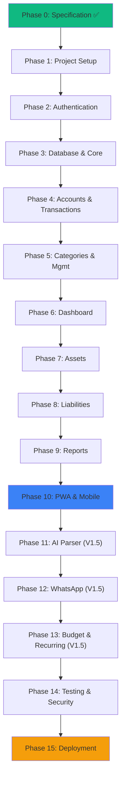

# 12 — Implementation Roadmap

> **Document Version**: 1.0  
> **Last Updated**: 2026-08-25  
> **Status**: Approved for Implementation  
> **Cross-references**: All specification documents (01-11)

---

## 1. Phased Implementation Strategy

### Overview

The implementation is divided into phases, each building on the previous one. Each phase produces a deployable increment. The AI coding agent (Antigravity) should complete one phase fully before starting the next.

```
Phase 0: Specification ✅ (this document set)
Phase 1: Project Setup & Foundation ✅ (completed 2026-08-31)
Phase 2: Authentication & User System ✅ (completed 2026-09-03)
Phase 3: Database & Financial Core ⬜ (next)
Phase 4: Accounts & Basic Transactions ⬜
Phase 5: Categories & Transaction Management ⬜
Phase 6: Dashboard ⬜
Phase 7: Assets & Investments ⬜
Phase 8: Liabilities ⬜
Phase 9: Reports ⬜
Phase 10: PWA & Mobile Polish ⬜
Phase 11: AI Transaction Parser (V1.5) ⬜
Phase 12: WhatsApp Integration (V1.5) ⬜
Phase 13: Budgeting & Recurring (V1.5) ⬜
Phase 14: Testing & Security Hardening ⬜
Phase 15: Deployment ⬜
```

---

## 2. Phase Specifications

### Phase 1: Project Setup & Foundation ✅ COMPLETED — 2026-08-31

**Objective**: Initialize the Laravel project with all dependencies, tooling, and base structure.

**Prerequisites**: None

**Actual Implementation Notes**:
- Used `laravel new` installer (Laravel Installer 5.25.1) with `--vue --pest --boost` flags instead of `composer create-project` — result is equivalent but includes Laravel Boost (AGENTS.md for AI guidance).
- `laravel/fortify` and `@laravel/passkeys` included automatically via Vue starter kit (covers auth scaffold).
- `AppLayout.vue`, dark/light toggle, and theme composable are partially scaffolded by the starter kit. Full Obsidian Finance theming is deferred to Phase 4–6 (per-page UI work).
- `config/finance.php` and PWA plugin deferred to Phase 10 (PWA phase).
- `chart.js` / `vue-chartjs` / `dayjs` deferred to Phase 6 (Dashboard phase) to avoid unused dependencies.
- Database changed from SQLite (default) to PostgreSQL: `finance_db` / `financeuser`.

**Verified Stack**:

| Component | Version | Status |
|-----------|---------|--------|
| PHP | 8.4.8 (Homebrew) | ✅ |
| Laravel Framework | 13.26.1 | ✅ |
| Inertia.js (Laravel adapter) | ^3.0 | ✅ |
| Inertia.js (Vue adapter) | ^3.0 | ✅ |
| Vue | 3.5.13 | ✅ |
| Tailwind CSS | 4.3.3 | ✅ |
| TypeScript | 5.x | ✅ |
| Vite | 8.x | ✅ |
| Pest (testing) | via PHPUnit ^12.5 | ✅ |
| Laravel Fortify (auth) | ^1.37.2 | ✅ |
| Laravel Passkeys | ^0.2.0 | ✅ |
| Laravel Wayfinder | ^0.1.14 | ✅ |
| Laravel Boost (AGENTS.md) | installed | ✅ |
| Reka UI (Vue component lib) | ^2.9.8 | ✅ |
| Lucide (icons via @lucide/vue) | ^1.17.0 | ✅ |
| VueUse | ^12.8.2 | ✅ |
| PostgreSQL | 14.17 (Homebrew) | ✅ |
| Database | finance_db | ✅ |
| DB User | financeuser | ✅ |
| Build output | 40 assets in public/build | ✅ |
| Migrations | 5 tables migrated | ✅ |

**Acceptance Criteria**:
- [x] `php artisan serve` starts without errors
- [x] `npm run dev` starts Vite without errors
- [x] Browser shows Laravel 13 welcome page at http://127.0.0.1:8000
- [x] TypeScript compilation succeeds
- [x] Tailwind CSS v4 renders correctly
- [x] All 39 Pest tests pass (39/39)
- [x] PostgreSQL `finance_db` connected and migrated
- [x] `composer run dev` runs backend + frontend + queue worker together

> **Note**: `AppLayout.vue` with Obsidian Finance theme, `config/finance.php`, PWA plugin, and chart libraries will be implemented in their respective phases (4, 6, 10) to keep Phase 1 lean.

---

### Phase 2: Authentication & User System ✅ COMPLETED

**Objective**: Implement user registration, login, and profile management.

**Prerequisites**: Phase 1 ✅

**Tasks**:
1. [x] ~~Install Laravel Breeze~~ — Already scaffolded via Vue starter kit + Laravel Fortify
2. [x] Customize `users` migration with additional fields: `timezone`, `theme`, `default_currency`, `month_start_day`, `date_format`
3. [x] Restyle Auth pages (Login, Register) to match Obsidian Finance dark theme from `docs/09_DESIGN_SYSTEM.md`
4. [x] Restyle profile/settings page
5. [x] Configure session driver (currently `database` — acceptable for V1, Redis in production)
6. [x] Verify rate limiting for auth routes (already configured via Fortify)
7. [x] Add CSRF protection verification

**Expected Output**:
- User can register, login, logout
- Profile settings page functional
- Theme preference persisted

**Database Changes**:
- `users` table with custom fields (per Database Schema §3.1)

**Acceptance Criteria**:
- [x] Registration creates user with default settings
- [x] Login authenticates and redirects to dashboard (placeholder)
- [x] Logout destroys session
- [x] Rate limiting blocks after 5 failed logins
- [x] Theme toggle persists across sessions

---

### Phase 3: Database & Financial Core ⬜ NEXT

**Objective**: Create all V1 database migrations, models, enums, and the core financial service layer.

**Prerequisites**: Phase 2

**Tasks**:
1. Create PHP enums: `TransactionType`, `AccountType`, `AssetType`, `LiabilityType`, `EntryType`, `TransactionSource`
2. Create all V1 migrations (per Database Schema §5):
   - `accounts`, `categories`, `asset_accounts`, `liabilities`
   - `transactions`, `transaction_entries`
   - `asset_transactions`, `liability_transactions`
   - `net_worth_snapshots`, `audit_logs`
3. Create Eloquent models with relationships, casts, and scopes
4. Add global scope for user isolation on all models
5. Create `Money` value object (integer wrapper with formatting)
6. Create `TransactionService` with core methods (per System Architecture §6.1)
7. Create `AccountService` with balance calculation/caching
8. Create `DefaultCategorySeeder`
9. Implement `Auditable` trait
10. Set up model factories for testing

**Expected Output**:
- All tables created via migration
- Models with proper relationships
- TransactionService creates valid double-entry transactions
- DefaultCategorySeeder populates categories

**Database Changes**: All V1 tables

**Tests**:
```
- TransactionService creates income with correct entries
- TransactionService creates expense with correct entries
- TransactionService creates transfer without income/expense impact
- Account balance updates correctly after transaction
- Double-entry validation: debits == credits
- Money value object formats correctly
- Global scope filters by user_id
```

**Acceptance Criteria**:
- [ ] All migrations run successfully
- [ ] `php artisan db:seed` creates default categories
- [ ] Unit tests pass for TransactionService
- [ ] Money value object handles IDR formatting

---

### Phase 4: Accounts & Basic Transactions

**Objective**: Build the account management and basic transaction CRUD UI.

**Prerequisites**: Phase 3

**Tasks**:
1. Create `AccountController` with CRUD operations
2. Create Account pages: Index, Create, Edit, Show (balance + transactions)
3. Create `TransactionController` with CRUD operations
4. Create Transaction pages: Index (list with search/filter), Create (form), Edit, Show
5. Build reusable components:
   - `MoneyDisplay.vue` (formatted amount display)
   - `MoneyInput.vue` (numeric input with formatting)
   - `TransactionRow.vue` (list item)
   - `EmptyState.vue`
6. Implement transaction type selection flow (Income/Expense/Transfer/More)
7. Implement search and filter functionality
8. Build mobile-friendly transaction create modal/page
9. Create desktop sidebar navigation
10. Create mobile bottom navigation

**Expected Output**:
- Accounts can be created, viewed, edited, deactivated
- Income, expense, and transfer transactions can be created and listed
- Search and filter work on transaction list
- Mobile and desktop navigation functional

**Database Changes**: None (tables from Phase 3)

**Acceptance Criteria**:
- [ ] Create account with initial balance (adjustment transaction)
- [ ] Create income transaction → account balance increases
- [ ] Create expense transaction → account balance decreases
- [ ] Create transfer → source decreases, destination increases, no income/expense
- [ ] Transaction list shows with search and filters
- [ ] Mobile bottom nav works
- [ ] Desktop sidebar nav works

---

### Phase 5: Categories & Transaction Management

**Objective**: Complete the category management system and polish the transaction workflow.

**Prerequisites**: Phase 4

**Tasks**:
1. Create `CategoryController` with CRUD operations
2. Create Category management page (list, create, edit, reorder)
3. Build `CategoryPicker.vue` component (icon grid)
4. Implement subcategory support (one level)
5. Add category icon and color selection in category form
6. Implement transaction edit and delete with proper entry reversal
7. Add transaction confirmation dialog for deletes
8. Add transaction detail view (show page)
9. Implement quick add FAB (floating action button) on mobile
10. Polish form UX: default account, default date, keyboard shortcuts

**Expected Output**:
- Categories fully manageable
- Category picker works in transaction forms
- Transaction edit/delete working correctly
- Quick add button on mobile

**Database Changes**: None

**Acceptance Criteria**:
- [ ] Create/edit/deactivate categories
- [ ] Subcategories display under parent
- [ ] Category picker shows icons in grid
- [ ] Edit transaction reverses old entries and creates new
- [ ] Delete transaction reverses entries and removes
- [ ] FAB opens quick add modal on mobile

---

### Phase 6: Dashboard

**Objective**: Build the main dashboard with financial overview.

**Prerequisites**: Phase 5

**Tasks**:
1. Create `DashboardController` and `DashboardService`
2. Build dashboard page with sections:
   - Net worth card
   - Total assets / total liabilities quick stats
   - Monthly cash flow (income vs expense)
   - Asset allocation chart (placeholder until Phase 7)
   - Recent transactions list
3. Implement `SnapshotNetWorth` scheduled command
4. Build chart components using Chart.js:
   - Cash flow bar chart
   - Asset allocation donut chart (basic)
5. Implement cache layer for dashboard data
6. Add period selector for cash flow (This Month / Last Month)
7. Style cards according to design system (Obsidian Finance theme)
8. Implement responsive layout (1-col mobile, 2-3 col desktop)

**Expected Output**:
- Dashboard shows real financial data
- Charts render correctly
- Data is cached for performance
- Net worth snapshot job runs daily

**Database Changes**: None (net_worth_snapshots table from Phase 3)

**Acceptance Criteria**:
- [ ] Net worth = sum of accounts + assets - liabilities
- [ ] Cash flow shows correct monthly income/expense
- [ ] Recent transactions show latest 10
- [ ] Dashboard loads in < 1.5 seconds
- [ ] Net worth snapshot command runs and stores data
- [ ] Charts render on mobile and desktop

---

### Phase 7: Assets & Investments

**Objective**: Build the asset/investment tracking system.

**Prerequisites**: Phase 6

**Tasks**:
1. Create `AssetController` and `AssetService`
2. Create asset account CRUD pages (Create, Edit, Show)
3. Build Portfolio page with tabs: Investments, Other Assets
4. Implement asset purchase transaction flow:
   - Select source account + asset account
   - Enter quantity, price per unit
   - Calculate total amount
   - Create linked transaction + asset_transaction
5. Implement asset sale transaction flow
6. Calculate and display:
   - Current value (quantity × current_price)
   - Unrealized P/L (current_value - cost_basis)
   - P/L percentage
7. Implement manual price update (edit current_price)
8. Update dashboard asset allocation chart with real data
9. Build portfolio summary card
10. Handle value-only assets (property, vehicle) with manual_value

**Expected Output**:
- Asset accounts can be created and managed
- Buy/sell transactions correctly update quantities and balances
- Portfolio page shows all investments with P/L
- Dashboard asset allocation reflects real data

**Database Changes**: None (tables from Phase 3)

**Tests**:
```
- Asset purchase: cash decreases, asset quantity increases
- Asset sale: asset quantity decreases, cash increases
- Average price recalculates on buy
- Net worth unchanged on asset purchase (before fees)
- Unrealized P/L calculates correctly
- Value-only assets use manual_value
```

**Acceptance Criteria**:
- [ ] Create stock/crypto/mutual fund asset accounts
- [ ] Buy BTC: cash -500k, BTC quantity increases
- [ ] Portfolio shows unrealized P/L
- [ ] Manual price update changes current value
- [ ] Dashboard allocation chart shows real breakdown

---

### Phase 8: Liabilities

**Objective**: Build the liability tracking system.

**Prerequisites**: Phase 7

**Tasks**:
1. Create `LiabilityController` and `LiabilityService`
2. Create liability CRUD pages
3. Implement liability payment flow:
   - Select source account + liability
   - Enter payment amount
   - Create transaction reducing both account and liability balance
4. Implement liability increase (new charges, e.g., credit card purchases)
5. Display liability details: balance, credit limit, interest rate, due date
6. Add liabilities to Portfolio page (third tab)
7. Update dashboard with real liability data
8. Update net worth calculation to include liabilities

**Expected Output**:
- Liabilities can be created and managed
- Payments correctly reduce liability balance
- Net worth reflects liabilities
- Dashboard shows accurate total liabilities

**Database Changes**: None

**Acceptance Criteria**:
- [ ] Create credit card liability with limit
- [ ] Payment reduces liability + account balance
- [ ] Net worth = assets - liabilities
- [ ] Liability shows on portfolio page

---

### Phase 9: Reports

**Objective**: Build the financial reporting system.

**Prerequisites**: Phase 8

**Tasks**:
1. Create `ReportController` and `ReportService`
2. Build Reports page with report type selection
3. Implement reports:
   - Monthly income/expense bar chart (last 6 months)
   - Cash flow line chart
   - Expense by category pie chart
   - Net worth trend line chart (from snapshots)
   - Asset allocation chart
4. Build `DateRangePicker.vue` component
5. Add period selection to all reports
6. Display data tables alongside charts
7. Implement efficient report queries (DB-level aggregation)

**Expected Output**:
- All V1 reports functional
- Date range filtering works
- Charts render correctly on mobile/desktop

**Database Changes**: None

**Acceptance Criteria**:
- [ ] Income/expense report shows correct monthly totals
- [ ] Cash flow chart excludes transfers
- [ ] Expense by category matches transaction data
- [ ] Net worth trend shows historical snapshots
- [ ] Date range picker works for all reports

---

### Phase 10: PWA & Mobile Polish

**Objective**: Make the app installable as a PWA and polish the mobile experience.

**Prerequisites**: Phase 9

**Tasks**:
1. Configure `vite-plugin-pwa`:
   - Web app manifest (name, icons, theme color, background color)
   - Service worker (cache-first for app shell, network-first for API)
   - Standalone display mode
2. Generate PWA icons (multiple sizes: 192x192, 512x512, maskable)
3. Create splash screen / loading experience
4. Test installability on Chrome (Android) and Safari (iOS)
5. Polish mobile experience:
   - Verify bottom nav works with iOS safe areas
   - Touch-friendly form controls (min 44×44px)
   - Proper keyboard behavior on money input
   - Pull-to-refresh on transaction list
   - Swipe actions on transaction rows
6. Test and fix responsive layouts at all breakpoints
7. Optimize Lighthouse scores (performance, PWA, accessibility)
8. Add proper meta tags for SEO and social sharing

**Expected Output**:
- App installable on mobile devices
- Service worker caches app shell
- Mobile experience feels native-like
- Lighthouse PWA score > 90

**Database Changes**: None

**Acceptance Criteria**:
- [ ] App is installable on Android Chrome
- [ ] App opens in standalone mode (no browser chrome)
- [ ] Service worker caches static assets
- [ ] Bottom nav respects iOS safe area
- [ ] All touch targets ≥ 44×44px
- [ ] Lighthouse PWA score > 90

---

### Phase 11: AI Transaction Parser (V1.5)

**Objective**: Implement the AI-powered natural language transaction parser.

**Prerequisites**: Phase 10 (V1 complete)

**Tasks**:
1. Create `AiProviderInterface` and implement `GeminiAdapter`
2. Create `AiParserService` with:
   - Input normalization (amount regex extraction)
   - Prompt building with user context
   - AI API call
   - Response parsing and validation
   - Confidence scoring
3. Create `AiParseResult` value object
4. Implement confidence-based routing (auto-confirm / ask / reject)
5. Build AI Quick Input component (text box on dashboard or transaction page)
6. Show parsed preview with editable fields
7. Create `ai_parsing_logs` table and migration
8. Implement AI logging
9. Test with Indonesian language inputs
10. Add OpenAI adapter as fallback

**Expected Output**:
- User can type natural language to create transactions
- AI correctly parses common Indonesian financial expressions
- Confidence-based confirmation flow works
- All parsing attempts are logged

**Database Changes**: `ai_parsing_logs` table

**Tests**:
```
- "beli nasi goreng 15rb" → expense, 15000, food
- "gajian 8jt" → income, 8000000, salary
- "transfer bca ke mandiri 1jt" → transfer, 1000000
- Amount normalization: "15rb" = 15000, "1.5jt" = 1500000
- Low confidence triggers clarification
- AI API timeout falls back to manual entry
```

**Acceptance Criteria**:
- [ ] AI correctly parses > 80% of common inputs
- [ ] Confidence routing works (high/medium/low)
- [ ] Quick input component functional
- [ ] All parses logged in ai_parsing_logs
- [ ] Fallback works when AI is unavailable

---

### Phase 12: WhatsApp Integration (V1.5)

**Objective**: Connect WhatsApp as an input channel for the AI parser.

**Prerequisites**: Phase 11

**Tasks**:
1. Create `MessagingProviderInterface` and implement `FonnteAdapter`
2. Create `WhatsAppWebhookController`
3. Create `VerifyWhatsAppSignature` middleware
4. Create `ProcessWhatsAppMessage` queue job
5. Create `webhook_events` table and migration
6. Implement idempotency (message_id deduplication)
7. Implement user lookup by phone number
8. Connect to AiParserService for message parsing
9. Implement confirmation flow via WhatsApp responses
10. Add WhatsApp phone number verification in user settings
11. Test end-to-end: WhatsApp message → parsed transaction

**Expected Output**:
- WhatsApp messages are received via webhook
- Messages are parsed by AI and create transactions
- User receives confirmation in WhatsApp
- Duplicate messages are handled

**Database Changes**: `webhook_events` table, `whatsapp_number` on users

**Acceptance Criteria**:
- [ ] Webhook receives and verifies messages
- [ ] Duplicate messages are detected and ignored
- [ ] AI parser processes WhatsApp messages
- [ ] Confirmation sent back via WhatsApp
- [ ] User can link phone number in settings

---

### Phase 13: Budgeting & Recurring Transactions (V1.5)

**Objective**: Add budgeting and recurring transaction features.

**Prerequisites**: Phase 12

**Tasks**:
1. Create `recurring_transactions`, `budgets`, `budget_items` migrations
2. Create models and controllers for recurring transactions and budgets
3. Implement recurring transaction templates (CRUD)
4. Implement scheduled generation of recurring transactions
5. Create budget CRUD with per-category limits
6. Calculate budget spent/remaining from actual transactions
7. Display budget progress (progress bars, color coding)
8. Build recurring transaction management page
9. Build budget management page
10. Add budget summary to dashboard

**Expected Output**:
- Recurring transactions auto-generate on schedule
- Budgets show spending progress
- Dashboard shows budget overview

**Database Changes**: `recurring_transactions`, `budgets`, `budget_items`

**Acceptance Criteria**:
- [ ] Recurring template generates transactions on schedule
- [ ] Budget shows correct spent vs limit per category
- [ ] Progress bar colors: green/yellow/red
- [ ] Over-budget categories are highlighted

---

### Phase 14: Testing & Security Hardening

**Objective**: Comprehensive testing and security review.

**Prerequisites**: All previous phases

**Tasks**:
1. Write feature tests for all major flows:
   - Auth (register, login, logout)
   - Account CRUD
   - Transaction CRUD (all types)
   - Asset purchase/sale
   - Liability payment
   - Dashboard data accuracy
   - Report calculations
2. Write unit tests for:
   - Money value object
   - TransactionService (all transaction types)
   - Balance calculations
   - AI parser (with mocked API responses)
   - Amount normalization
3. Financial integrity tests:
   - Net worth consistency after series of transactions
   - Transfer doesn't affect income/expense
   - Asset purchase doesn't affect net worth
   - Double-entry validation
4. Security hardening:
   - Verify all security headers
   - Run `composer audit` and `npm audit`
   - Verify CSRF on all forms
   - Verify rate limiting
   - Verify webhook signature checking
   - Review .env for exposed secrets
5. Create balance verification command
6. Performance testing: Dashboard load time < 1.5s

**Expected Output**:
- Comprehensive test suite
- All tests passing
- Security checklist complete
- Balance verification command working

**Database Changes**: None

**Acceptance Criteria**:
- [ ] All feature tests pass
- [ ] All unit tests pass
- [ ] Financial calculation tests pass
- [ ] Security checklist complete (per Security Spec §15)
- [ ] Balance verification finds no discrepancies
- [ ] Lighthouse performance > 85

---

### Phase 15: Deployment

**Objective**: Deploy the application to production.

**Prerequisites**: Phase 14

**Tasks**:
1. Provision VPS (Hetzner CX22 or similar)
2. Install server stack (Nginx, PHP-FPM, PostgreSQL, Redis)
3. Configure domain and SSL (Let's Encrypt)
4. Deploy application code
5. Run migrations on production
6. Configure supervisor for queue worker
7. Set up cron for scheduler
8. Configure backup script and schedule
9. Set up basic monitoring (Uptime Kuma or equivalent)
10. Configure webhook URLs with WhatsApp provider
11. Verify all integrations work in production
12. Test full user flow on production

**Expected Output**:
- Application live at domain
- HTTPS working
- Queue worker processing jobs
- Scheduler running
- Backups configured
- Monitoring active

**Database Changes**: None (migrations already defined)

**Acceptance Criteria**:
- [ ] Application accessible via HTTPS
- [ ] Registration and login work
- [ ] Transaction creation works
- [ ] Dashboard loads with real data
- [ ] Backup runs successfully
- [ ] Health endpoint returns OK

---

## 3. Phase Dependencies



---

## 4. Antigravity Development Rules

These rules must be followed by the AI coding agent during implementation:

### Code Quality
1. Read all project documentation before modifying code
2. Never invent undocumented requirements
3. Never rewrite working architecture without justification
4. Keep changes small and incremental
5. Verify existing code before creating new implementations
6. Avoid duplicate functionality
7. Prefer reusable components
8. Maintain consistent naming conventions
9. Maintain clean separation between domain logic and UI
10. Avoid unnecessary abstractions

### Financial Integrity
11. **NEVER use floating-point arithmetic for financial values** — use BIGINT for IDR
12. Treat financial calculations as high-integrity logic
13. **NEVER let AI output directly execute database writes** — always validate first
14. All financial operations must be wrapped in database transactions
15. Double-entry rule: debits MUST equal credits on every transaction

### Security
16. Never expose secrets in code or logs
17. Never hardcode API credentials — use .env
18. Never modify production data directly
19. Always validate and sanitize input

### Process
20. Run tests after meaningful changes
21. Never skip migrations
22. Update documentation when architecture changes
23. Explain important architectural decisions
24. Run `composer audit` and `npm audit` before deployment

---

## 5. Stitch Design Workflow

Before implementing frontend for each phase, the design can optionally be prototyped in Stitch:

```
Specification (this doc set)
  → UI/UX Specification (08)
  → Design System (09)
  → Stitch prototype (visual mockup)
  → Review with stakeholder
  → Approve design
  → Antigravity implements using approved design as reference
```

**Important**: Stitch output is a visual reference only. Business logic, data structures, and financial rules come from the specification documents, not from the UI mockup.

---

## 6. Timeline Estimates

| Phase | Estimated Duration | Cumulative |
|-------|-------------------|------------|
| Phase 1: Setup | 1 day | Day 1 |
| Phase 2: Auth | 1 day | Day 2 |
| Phase 3: Database & Core | 2 days | Day 4 |
| Phase 4: Accounts & Transactions | 3 days | Day 7 |
| Phase 5: Categories & Mgmt | 2 days | Day 9 |
| Phase 6: Dashboard | 2 days | Day 11 |
| Phase 7: Assets | 3 days | Day 14 |
| Phase 8: Liabilities | 2 days | Day 16 |
| Phase 9: Reports | 2 days | Day 18 |
| Phase 10: PWA | 2 days | Day 20 |
| **V1 Complete** | **~4 weeks** | |
| Phase 11: AI Parser | 3 days | Day 23 |
| Phase 12: WhatsApp | 2 days | Day 25 |
| Phase 13: Budget/Recurring | 3 days | Day 28 |
| Phase 14: Testing | 3 days | Day 31 |
| Phase 15: Deployment | 1 day | Day 32 |
| **V1.5 Complete** | **~6-7 weeks total** | |

Note: These are estimates for AI-assisted development. Actual times may vary.

---

## 7. Cross-Document Consistency Verification

### Verified Consistency Points

| Check | Documents | Status |
|-------|-----------|--------|
| Transaction types match across schema, feature spec, and service layer | 03, 04, 05 | ✅ Consistent |
| Account types match across feature spec and database schema | 03, 05 | ✅ Consistent |
| Asset types match across feature spec and database schema | 03, 05 | ✅ Consistent |
| Liability types match across feature spec and database schema | 03, 05 | ✅ Consistent |
| Money representation (BIGINT) consistent everywhere | 03, 04, 05 | ✅ Consistent |
| Double-entry model consistent between architecture and schema | 04, 05 | ✅ Consistent |
| AI confidence thresholds consistent between AI spec and integration spec | 06, 07 | ✅ Consistent (0.85/0.50) |
| Navigation structure consistent between UI spec and feature spec | 03, 08 | ✅ Consistent |
| Color tokens consistent between UI spec and design system | 08, 09 | ✅ Consistent |
| Security measures consistent between security spec and deployment | 10, 11 | ✅ Consistent |
| V1/V1.5/V2 scope consistent between scope doc and roadmap | 02, 12 | ✅ Consistent |
| Category defaults consistent between feature spec and seeder design | 03, 05 | ✅ Consistent |

### Resolved Conflicts

1. **Transaction entries vs entries count**: The double-entry model in the architecture (§3.1) says "exactly 2 entries." The feature spec (§3.3) confirms this for V1. Multi-entry splits (expense splitting) are explicitly deferred to V2+.

2. **WhatsApp in V1 vs V1.5**: The PRD lists WhatsApp as V1.5. The roadmap confirms it's Phase 12 (after V1 is complete). No conflict.

3. **Tailwind version**: Design system references Tailwind v4. System architecture confirms v4. Consistent.
